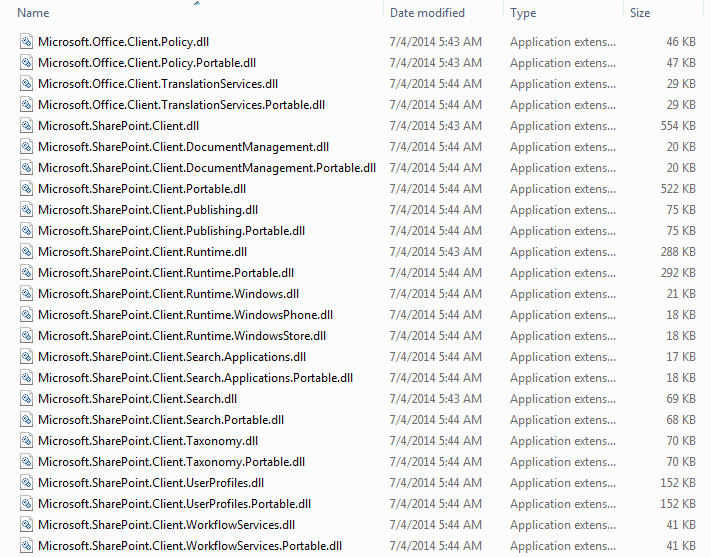

# SPO Custom CSS via PowerShell / CSOM
Sample PowerShell script to deploy custom css to a site collection via the CSOM API.

_Note: this solution does not alter the site masterpage._ 

## Instructions

To implement the solution, you will:

1. Generate the css file
2. Upload the css file to your SiteAssets library
3. Run the PowerShell script to point to the css file

## 1. Generate the CSS file
You can either use the default theme or create a child theme. To create a child theme, you'll use [Sass](http://sass-lang.com/). Make sure to download a Sass compiler, such as [Koala](http://koala-app.com/).

### Default Theme
To install the default theme, skip to [Step 3](#3-run-powershell--csom-against-your-site-collection).

### Custom Child Theme
View sample child themes by opening any of the `sample.*.scss` files. 

To create a simple green child theme, create a new file and include the following:
```Sass
// Green Theme
// -----------

// Insert custom variables here. Can be a separate file or inline scss
$theme-primary: #019864;


// Import theme files

@import 'cos.variables';
@import 'cos.mixins';
@import 'cos.theme';

// Insert additional custom css below this line
```
You can overwrite any of the variables contained in [cos.variables.scss](scss/cos.variables.scss).

Once the custom theme is done, compile the Sass file using a Sass compiler, such as [Koala](http://koala-app.com/). Most compilers can be configured to auto-compile every time the file is updated (saved).

* Use this new css file in [Step 2](#2-upload-css-to-your-siteassets-library) below.

## 2. Upload CSS to your SIteAssets library
The default Site Assets library is usually located at `/sites/sitecollection/SiteAssets/`

1. Open up SiteAssets
2. Create a folder titled "css"
3. Upload your `.css` file to `/SiteAssets/css/`

If you are using a custom theme, make sure to update the [PowerShell script](CSOM-AlternateCSS-ApplyToSiteCollection.ps1) to point to your `.css` file.

For example, to deploy the `sample.green.css` theme, you would change **lines 49-51** from this:

```PowerShell
# path to css file - change this depending on what file you use
#$cssUrl = $rootWeb.ServerRelativeUrl + "/SiteAssets/css/sample.green.css"
$cssUrl = "/SiteAssets/css/cos.tenant.css"
```

to this:

```PowerShell
# path to css file - change this depending on what file you use
$cssUrl = $rootWeb.ServerRelativeUrl + "/SiteAssets/css/sample.green.css"
#$cssUrl = "/SiteAssets/css/cos.tenant.css"
```

## 3. Run PowerShell + CSOM against your Site Collection

1. Prepare the PC you will run scripts against SPO
  * Ensure PowerShell and/or PowerShell ISe are installed on your workstation. Link - [Windows Management Framework 4.0](https://www.microsoft.com/en-us/download/details.aspx?id=40855)
  * Ensure the `.dll`s are installed on your hard drive. The path should be `C:\Program Files\Common Files\Microsoft Shared\Web Server Extensions\16\ISAPI\`
  
2. Change the ExecutionPolicy for PowerShell. By default, you will not be able to run scripts on your PC. Make sure to be careful about what scripts you run on your workstation.
  * Here's the command to change the ExecutionPolicy:
  
    ```PowerShell
    Set-ExecutionPolicy -Scope LocalMachine -ExecutionPolicy Unrestricted
    ```
3. Open [CSOM-AlternateCSS-ApplyToSiteCollection.ps1](CSOM-AlternateCSS-ApplyToSiteCollection.ps1) in PowerShell ISE
  * Update the `$cssUrl` value on *line 50* if necessary.
4. Click "Run"
5. Enter your site collection URL.
  * _Also works on subsites. Enter the url of the location you would like to install the custom theme._
6. Enter your login credentials
7. Done

Once the scrip finishes running, verify the changes have been applied to your site collection.

## References
* [SharePoint 2013 .NET Server, CSOM, JSOM, and REST API index](https://msdn.microsoft.com/en-us/library/office/dn268594.aspx)
  * Particularly useful references:
    * [Site -- aka Site Collection -- members](https://msdn.microsoft.com/en-us/library/office/microsoft.sharepoint.client.site_members.aspx)
    * [Web -- aka subsite -- members](https://msdn.microsoft.com/en-us/library/office/microsoft.sharepoint.client.web_members.aspx)
    * [AlternateCssUrl property](https://msdn.microsoft.com/en-us/library/office/microsoft.sharepoint.client.web.alternatecssurl.aspx)
* [Using CSOM in PowerShell scripts with Office 365](http://www.sharepointnutsandbolts.com/2013/12/Using-CSOM-in-PowerShell-scripts-with-Office365.html)
* [Sass](http://sass-lang.com/)